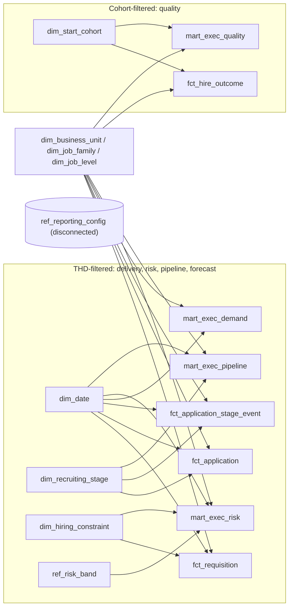

# Executive Summary data contracts

This folder holds the analytics-ready data contracts for the TA Executive Summary page.
`spec.md` and `wireframe.html` are the source of truth; these YAML files translate them
into a small, governed star schema that Power BI can load without rebuilding business logic.

Fixed reporting as-of date: **2026-05-31** (from `reference/ref_reporting_config.yaml`).
Nothing reads the system clock.

## Dataset inventory

| Layer | Dataset | Grain | Rows (approx.) | Main job |
|---|---|---|---|---|
| dimension | `dim_date` | one row per day, 2024-01-01 to 2027-05-31 | 1,247 | Target Hire Date (THD) axis and slicer |
| dimension | `dim_business_unit` | one row per Business Unit | small | BU slicer, conformed across delivery and quality |
| dimension | `dim_job_family` | one row per Job Family | small | Job Family slicer; main forecast fallback attribute |
| dimension | `dim_job_level` | one row per Job Level | small | Job Level slicer |
| dimension | `dim_recruiting_stage` | one row per stage (Review to Offer) | 5 | Governed stage order, next stage and SLA days (seed rows in the YAML) |
| dimension | `dim_hiring_constraint` | one row per constraint category | 7 | Governed labels and order for the constraint bars (seed rows in the YAML) |
| dimension | `dim_start_cohort` | one row per employee start month, Jan 2024 to May 2026 | 29 | Cohort axis for quality visuals; owns maturity and rolling-12 window logic |
| reference | `ref_reporting_config` | exactly one row | 1 | As-of date, coverage window, targets, thresholds |
| reference | `ref_risk_band` | one row per TOAD risk band | 4 | Missed / High / Medium / On Track rules and sort order |
| fact | `fct_requisition` | one row per requisition, as-of state | thousands | Demand, filled, open, TOAD risk, constraint, capped forecast fills |
| fact | `fct_application` | one row per application, as-of state | tens of thousands | Active pipeline snapshot, offer outcome, Time to Fill, candidate yield |
| fact | `fct_application_stage_event` | one row per application per stage entry | ~5x applications | Historical conversion, completed days in stage, active stage age |
| fact | `fct_hire_outcome` | one row per started hire | ~ filled positions | 60-day maturity, early attrition, same-hire Time to Fill |
| mart | `mart_stage_yield` | BU + Job Family + Job Level + stage | small | Stage-to-acceptance yield with documented fallback (forecast training) |
| mart | `mart_exec_demand` | THD month + BU + Job Family + Job Level | small | Fill Rate KPI, demand context, actual vs forecast trend |
| mart | `mart_exec_risk` | one row per open requisition | hundreds | At-Risk KPI, risk band bars, constraint bars |
| mart | `mart_exec_pipeline` | THD month + BU + Job Family + Job Level + stage | small | Pipeline health table (active, conversion, days vs SLA) |
| mart | `mart_exec_quality` | start cohort month + BU + Job Family + Job Level | small | 60-Day Early Attrition KPI and Speed vs Quality chart |

Each YAML documents purpose, grain, keys, columns and types, nullability, derivation,
relationships, business rules, data-quality tests and Power BI guidance.
`metric-def.yaml` is the governed definition of every metric on the page.

## Important relationships

All relationships are one-to-many, single direction, from dimension to fact or mart.
There are no fact-to-fact relationships in the Power BI model and no bidirectional filters.

- `dim_date[date_key]` → `fct_requisition`, `fct_application`, `fct_application_stage_event`, `mart_exec_risk` on `thd_date_key`; → `mart_exec_demand`, `mart_exec_pipeline` on `thd_month_key` (the date key of the first day of the THD month).
- `dim_business_unit`, `dim_job_family`, `dim_job_level` → every fact and every mart. Applications, stage events and hires carry the keys **inherited from their requisition**, so the same slicer filters all of them without joining facts together.
- `dim_recruiting_stage` → `fct_application` (current stage), `fct_application_stage_event`, `mart_exec_pipeline`, `mart_stage_yield`.
- `dim_hiring_constraint` → `fct_requisition`, `mart_exec_risk`.
- `ref_risk_band[risk_band_code]` → `fct_requisition`, `mart_exec_risk`.
- `dim_start_cohort[cohort_month_key]` → `fct_hire_outcome`, `mart_exec_quality`. **No path from `dim_date` to either.**
- `ref_reporting_config` is disconnected; measures read it with `MAX()`.

Logical links that exist in the pipeline but are deliberately **not** modelled in Power BI:
`fct_requisition` → `fct_application` → `fct_application_stage_event`, and `fct_application` → `fct_hire_outcome`.
Keeping them out is what stops `openings_position` and other position quantities from being duplicated by candidate-level joins.

## Recommended Power BI star schema

Modelling rules:

- Load the four `mart_exec_*` tables and the four facts. `mart_stage_yield` is optional (audit/tooltips).
- Mark `dim_date` as the date table; use `year_month` / `month_label` for the THD slicer so month-grain marts and day-grain facts filter identically.
- Hide all `*_key` columns; set summarisation to "Don't summarize" on duration and rate columns.
- Rates are always `DIVIDE(SUM(numerator), SUM(denominator))`. Rate columns stored in marts are row-grain reference values for validation and are hidden.
- Medians are `MEDIAN()` over the fact (`fct_application.time_to_fill_days`, `fct_application_stage_event.days_in_stage`, `fct_hire_outcome.time_to_fill_days`). Stored medians in marts are row-grain reference values only, because medians cannot be re-aggregated.
- Targets come from `ref_reporting_config`, never from mart columns.

## Date-role behaviour

| Visual group | Date basis | Table / column | Slicer effect |
|---|---|---|---|
| Fill Rate KPI, Median Time to Fill KPI, At-Risk KPI, Fill Rate vs Forecast trend, risk bars, constraint bars, pipeline table | Target Hire Date | `dim_date` via `thd_date_key` / `thd_month_key` | THD slicer applies; BU/JF/JL apply |
| 60-Day Early Attrition KPI, Speed vs 60-Day Early Attrition chart | Employee start cohort month | `dim_start_cohort` via `cohort_month_key` | THD slicer **cannot** reach these tables; BU/JF/JL apply |
| Days to TOAD, risk band, active stage age, maturity | Fixed as-of date | `ref_reporting_config.as_of_date` | Not a slicer; a page stamp |

Why two date roles instead of one date table with an inactive relationship: the quality window
is defined by cohort maturity, not by a user-selected range. A separate cohort dimension makes
the "ignore THD" behaviour structural rather than something every quality measure has to
undo with `REMOVEFILTERS`. `fct_hire_outcome` keeps an optional inactive relationship to
`dim_date` on `employee_start_date_key` for ad-hoc use only.

Cohort maturity rule: a start month is fully matured when its last day + 60 days is on or
before the as-of date. For 2026-05-31 the latest fully matured cohort is **March 2026**
(2026-03-31 + 60 = 2026-05-30; April fails because 2026-04-30 + 60 = 2026-06-29).
`dim_start_cohort.kpi_cohort_window` marks the latest 12 matured months (`latest_12`) and the
12 before them (`prior_12`).

## Build / dependency order

1. `ref_reporting_config`, `ref_risk_band` (seed values from YAML)
2. `dim_date`, `dim_start_cohort` (generated from config), `dim_recruiting_stage`, `dim_hiring_constraint` (seed rows), `dim_business_unit`, `dim_job_family`, `dim_job_level` (from source)
3. `fct_requisition` (base columns: status, dates, quantities, constraint, risk band) — pipeline/forecast columns are filled in step 6
4. `fct_application` (base columns) and `fct_application_stage_event`
5. `mart_stage_yield` (from stage events + application outcomes with a final outcome)
6. Apply yield: `fct_application.stage_to_acceptance_yield`; then `fct_requisition.active_pipeline_applications`, `expected_pipeline_fills_uncapped`, `expected_pipeline_fills` (capped at `openings_position`)
7. `fct_hire_outcome` (from accepted applications + HR start/termination events, flags from `dim_start_cohort`)
8. `mart_exec_demand`, `mart_exec_risk`, `mart_exec_pipeline`, `mart_exec_quality`
9. Reconciliation tests: marts vs facts (see each mart's `data_quality_tests`)

## Major modelling decisions

1. **Position quantities live only in `fct_requisition`.** `mart_exec_demand` and `mart_exec_risk` are aggregations/projections of it. Candidate-level tables never carry `openings_position`, and no fact-to-fact relationship exists, so quantities cannot be duplicated.
2. **Requisition attributes are inherited downward.** THD, BU, Job Family, Job Level and approval date are denormalised onto applications, stage events and hires. This gives one clean star with single-direction filters instead of snowflaked fact chains.
3. **TOAD is source data.** `target_offer_acceptance_date` is passed through unchanged; `days_to_toad` and `risk_band_code` are computed from it and the configured as-of date, and only for open requisitions.
4. **`requested_positions = filled_positions + openings_position`** is a hard test for every non-cancelled requisition. Withdrawn seats go to `cancelled_positions` (audit only) so the identity holds and cancelled demand never enters KPIs.
5. **Offer data is integrated into `fct_application`.** The page needs accepted/declined/rescinded/withdrawn states and the accepted date; a separate offer fact would add a relationship without adding a visual.
6. **Three pipeline populations stay separate.** Active snapshot (`fct_application.is_active_pipeline`), completed historical conversion (`fct_application_stage_event.is_completed`, `advanced_to_next_stage`) and completed durations (`days_in_stage`). Rows with a null exit date are excluded from conversion, so candidates still in process are never failed conversions. Active age is a separate column from completed duration.
7. **Stage flow and SLA are governed in `dim_recruiting_stage` seed rows.** Transformation code reads the dimension rather than hard-coding stage names.
8. **Forecast is trained and capped upstream.** `mart_stage_yield` uses only applications with a final outcome on or before the as-of date (no future leakage), with fallback `bu_jf_jl → jf_jl → jf → all` when a segment has fewer than `forecast_min_segment_observations`. Yield is applied per active candidate, summed per requisition and capped at `openings_position` on `fct_requisition`. Power BI only sums the capped value.
9. **Demand and forecast share one mart.** `mart_exec_demand` holds requested / filled / open plus expected pipeline fills and forecast filled positions at the same THD-month grain. A separate `mart_exec_forecast` would duplicate the same rows and keys.
10. **Quality is start-cohort based and structurally isolated from THD.** `dim_start_cohort` owns maturity and the rolling-12 window; `fct_hire_outcome` and `mart_exec_quality` connect only to it. The KPI is a weighted ratio (SUM of early exits / SUM of matured hires across the latest 12 matured cohorts), never an average of monthly rates.
11. **Speed vs Quality uses the same hires.** `fct_hire_outcome.time_to_fill_days` is the Time to Fill of each started hire, so the median per start cohort describes exactly the hires in the attrition rate for that cohort. This is different from the THD-based Median Time to Fill KPI, and both are documented as such.
12. **Medians are computed in Power BI from facts.** Marts store medians only as row-grain reference values for validation. This keeps every median correct under any slicer combination.
13. **What was left out on purpose:** no candidate dimension, no recruiter dimension, no offer fact, no separate forecast mart, no source-of-hire or cost data. None of these supports a visual on the Executive Summary.

## Verification: wireframe and spec coverage

| Wireframe element | Metric IDs | Source |
|---|---|---|
| Header stamp "As of 31 May 2026" | — | `ref_reporting_config.as_of_date` |
| Slicers: THD, Business Unit, Job Family, Job Level | — | `dim_date`, `dim_business_unit`, `dim_job_family`, `dim_job_level` |
| KPI Fill Rate + "vs 90% target" + Demand / Filled / Open footer | EXEC-01, EXEC-02, EXEC-03, EXEC-04 | `mart_exec_demand`, target from `ref_reporting_config` |
| KPI Median Time to Fill | EXEC-05 | `fct_application.time_to_fill_days` |
| KPI At-Risk Open Positions "of N open", "% of open", band legend | EXEC-08, EXEC-04, SUPP-01 | `mart_exec_risk`, `ref_risk_band` |
| KPI 60-Day Early Attrition, "87 ÷ 1,064", latest matured cohort | EXEC-13, SUPP-02, SUPP-03, SUPP-04 | `mart_exec_quality`, `dim_start_cohort`, target from `ref_reporting_config` |
| Actual vs Forecast Fill Rate trend with target line | EXEC-01, FCST-04, FCST-02, FCST-03 | `mart_exec_demand` by `dim_date.month_label` |
| Open positions by risk band | EXEC-06, EXEC-07 | `mart_exec_risk` + `ref_risk_band` |
| Open positions by primary constraint | EXEC-09 | `mart_exec_risk` + `dim_hiring_constraint` |
| Pipeline table: Active now | EXEC-10 | `mart_exec_pipeline.active_applications` |
| Pipeline table: Historical conversion | EXEC-11 | `mart_exec_pipeline` advanced / completed counts |
| Pipeline table: Median completed days, SLA, "Watch" call-out | EXEC-12 | `fct_application_stage_event.days_in_stage`, `dim_recruiting_stage.sla_days` |
| Speed vs 60-Day Early Attrition dual-axis chart with n per month | EXEC-14, EXEC-13, SUPP-02 | `fct_hire_outcome` + `mart_exec_quality` by `dim_start_cohort` |
| Low-volume cohort flag | SUPP-02 | `ref_reporting_config.min_cohort_size` |

Spec metrics EXEC-01 to EXEC-14 and section 7 (forecast, FCST-01 to FCST-04) all have a
governed definition in `metric-def.yaml` and a named source dataset above.
