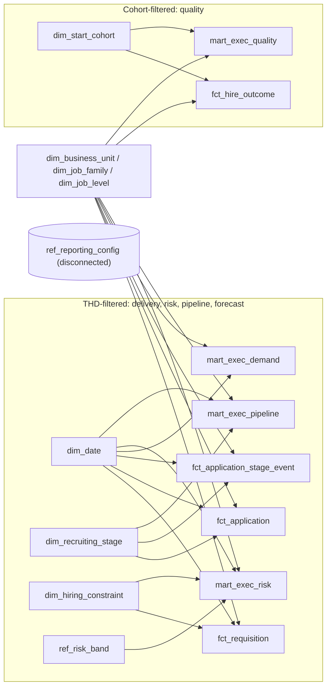

# Executive Summary data contracts

Contract release 1.2. Follow the authority order in the root `README.md`; dataset YAML governs analytics shapes and the wireframe is last.
This folder holds the analytics-ready data contracts for the TA Executive Summary page.
`spec.md` and `wireframe.html` are the source of truth; these YAML files translate them
into a small, governed star schema that Power BI can load without rebuilding business logic.

Fixed reporting as-of date: **2026-05-31** (from `reference/ref_reporting_config.yaml`).
Nothing reads the system clock.

## Core vocabulary: accepted offer, fill, hire

These three words mean different things and are never interchangeable. Getting them
confused is the single most common way a TA delivery number becomes wrong, so the
contracts model them as three separate concepts with their own columns.

**Offer acceptance is an immutable historical event. Current fill status is a separate
current-state concept.**

| Term | Meaning | Column | Changes later? | Used by |
|---|---|---|---|---|
| **Offer Accepted** | Historical TA fill event: the candidate accepted an offer on or before the as-of date | `fct_application.is_offer_accepted_event`, `offer_accepted_date` | **No.** A later rescind or renege never clears it | Time to Fill (EXEC-05), offer-stage conversion (EXEC-11), Accepted Offer Events (SUPP-06) |
| **Active Fill** | Current state of the seat: an accepted offer that has **not** subsequently been rescinded or reneged | `fct_application.is_active_fill`, `fct_requisition.filled_positions` | **Yes.** Falls when the offer is lost after acceptance and the seat reopens | Fill Rate (EXEC-01), Positions Filled (EXEC-02), the forecast (FCST-01 to FCST-04) |
| **Hire** | Employment event: the person actually started work | `fct_application.is_started`, `fct_hire_outcome` | Only forward (a start happens once) | 60-Day Early Attrition (EXEC-13), Speed vs Quality (EXEC-14), Started Hires (SUPP-08) |

What this means in practice:

- A candidate accepts an offer in March and reneges in April. March's Time to Fill and
  March's offer-stage conversion are unchanged - TA did secure that acceptance. The seat
  is restated as **open** today, so Fill Rate falls. The person is not a hire and never
  enters the quality KPI.
- `offer_accepted_date` is **never** nulled out by a rescind or a renege. Any rule that
  clears it is a defect, not a cleanup.
- An accepted offer waiting for its start date is a **fill**, not yet a **hire**. That gap
  is normal pipeline, not a loss; it is reported as Positions Filled minus Started Hires.
- The bridge between history and current state is
  `accepted_offer_events = filled_positions + lost_after_acceptance_positions`, exposed on
  the page as SUPP-07 Post-Acceptance Losses.

### The four offer-loss terms

An offer can be lost by either side, before or after acceptance. Those are four different
events with four different consequences, so each has its own reserved word. The words are
never used interchangeably:

| | **Before** acceptance | **After** acceptance |
|---|---|---|
| **Employer** ends it | `offer_withdrawn` | `offer_rescinded` |
| **Candidate** ends it | `offer_declined` | `candidate_renege` |

The column of the table is what matters for the numbers:

- **Before acceptance** — no acceptance event ever existed. `offer_accepted_date` is null,
  the seat was never filled, and nothing touches Fill Rate, Time to Fill or offer-stage
  conversion. The application simply left the process.
- **After acceptance** — the acceptance event stands and is preserved. The seat *was*
  filled and is now restated as open, so Fill Rate falls while Time to Fill and offer-stage
  conversion are unchanged. These two are the post-acceptance losses (SUPP-07).

A candidate who leaves with no offer on the table is `withdrawn`, and one screened out by
the employer is `rejected`. Neither is an offer-loss term.

Employer rescind and candidate renege are then kept apart on purpose. A rescind is a
demand-side decision (budget freeze, reorg); a renege is a candidate-market signal
(competing offer, counter-offer, a start date too far out). Both reopen the seat, but they
point at different problems and different owners.

Naming note: `fct_application_stage_event.exit_reason` used `offer_rescinded` for the
*pre*-acceptance case up to v1.1. It is now `offer_withdrawn`, so `rescind` means one thing
only — after acceptance — across the whole contract set.

### Scope limit: one acceptance per application

**One application contributes at most one governed accepted-offer event.** One accepted
offer equals one seat, so every offer-based figure is a COUNT of applications, which is what
keeps `accepted_offer_events`, `filled_positions` and `started_positions` reconcilable at
requisition grain.

Multiple offer versions before final acceptance — a revised salary, a moved start date, a
re-issued offer letter — are offer *versions*, not separate acceptance events. The
resolution rule is:

1. **Collapse administrative revisions of the same accepted offer.** A corrected salary, a
   moved start date or a re-issued letter for the offer the candidate accepted are versions
   of one event and must not produce a second acceptance.
2. **Preserve the earliest valid acceptance event for the accepted offer cycle.** The
   governed acceptance date is the moment the candidate committed, not the date of the last
   piece of paperwork.
3. **Quarantine ambiguous multiple-acceptance cases for review.** An application carrying
   more than one distinct acceptance cycle that cannot be resolved as revisions of a single
   offer is held for review — never silently collapsed, and never silently dropped.
4. **Audit the source, not only the output — and do not fail on legitimate revisions.**
   Multiple accepted offer versions on one source application are *expected*: rule 1 exists
   because they occur, so their presence must never fail a build on its own. An **audit
   model** must record every source application that arrived with more than one accepted
   version, with its resolution — `administrative_revision` or `quarantined` — and why. A
   uniqueness test on the resolved output only proves that the resolution ran; the audit
   model is what shows whether a real second acceptance was discarded.
5. **Fail hard on the three cases that mean something is wrong.** A multi-version
   application **missing from the audit model** — it was never classified, and no test that
   reads the model can see it; one recorded but left neither resolved nor quarantined; and a
   quarantined application reaching `fct_application`. The count of multi-version
   applications is reported, never gated on.
6. **Use a separate offer-event fact if genuine re-offer cycles are supported later.**

Resolution happens **upstream**, at the resolved-sources stage of the dependency flow,
before anything counts an acceptance. The rule must be documented where it is applied.

Not covered today: a genuine re-offer cycle, where a candidate accepts, the offer is lost to
a rescind or renege, and the same candidate is later re-offered and accepts again for the
same requisition. The source is expected to produce a new application for the second
attempt.

If multiple acceptance or re-offer cycles per application become a real requirement,
**introduce a separate offer-event fact** — one row per offer event, with an offer sequence
number and its own accepted / rescinded / reneged dates — and keep `fct_application` at one
row per application carrying the resolved current state. Do **not** overload `fct_application`
with `offer_accepted_date_2`, an offer array, or a repeated group of offer columns: that
breaks the application grain and every COUNT-based identity above. The full statement lives
in `facts/fct_application.yaml` under `assumptions.one_acceptance_per_application`.

## Dataset inventory

| Layer | Dataset | Grain | Rows (approx.) | Main job |
|---|---|---|---|---|
| dimension | `dim_date` | one row per day, 2024-01-01 to 2027-05-31 | 1,247 | Target Hire Date (THD) axis and slicer |
| dimension | `dim_business_unit` | one row per Business Unit | small | BU slicer, conformed across delivery and quality |
| dimension | `dim_job_family` | one row per Job Family | small | Job Family slicer; main forecast fallback attribute |
| dimension | `dim_job_level` | one row per Job Level | small | Job Level slicer |
| dimension | `dim_recruiting_stage` | one row per stage (Review to Offer) | 5 | Governed stage order, next stage and SLA days (seed rows in the YAML) |
| dimension | `dim_hiring_constraint` | one row per constraint category | 7 | Governed labels and order for the constraint bars (seed rows in the YAML) |
| dimension | `dim_start_cohort` | one row per employee start month, Jan 2024 to May 2026 | 29 | Cohort axis for quality visuals; owns maturity and rolling-12 window logic |
| reference | `ref_reporting_config` | exactly one row | 1 | As-of date, coverage window, targets, thresholds (one-row model over project variables, not a seed) |
| reference | `ref_risk_band` | one row per TOAD risk band | 4 | Missed / High / Medium / On Track rules and sort order |
| fact | `fct_requisition` | one row per requisition, as-of state | thousands | Demand, active fills, accepted-offer events, post-acceptance losses, starts, open, TOAD risk, constraint, capped forecast fills |
| fact | `fct_application` | one row per application, as-of state | tens of thousands | Active pipeline snapshot, current status, immutable offer-acceptance event, withdraw / decline / rescind / renege / start events, Time to Fill, candidate yield |
| fact | `fct_application_stage_event` | one row per application per stage entry | ~5x applications | Historical conversion, completed days in stage, active stage age |
| fact | `fct_hire_outcome` | one row per **started** hire | <= active fills | 60-day maturity, early attrition, same-hire Time to Fill. Accepted offers that never started are deliberately absent |
| mart | `mart_stage_yield` | BU + Job Family + Job Level + stage | small | Stage-to-active-fill yield with documented fallback (forecast training) |
| mart | `mart_exec_demand` | THD month + BU + Job Family + Job Level | small | Fill Rate KPI, demand context, actual vs forecast trend |
| mart | `mart_exec_risk` | one row per open requisition | hundreds | At-Risk KPI, risk band bars, constraint bars |
| mart | `mart_exec_pipeline` | THD month + BU + Job Family + Job Level + stage | small | Pipeline health table (active, conversion, days vs SLA) |
| mart | `mart_exec_quality` | start cohort month + BU + Job Family + Job Level | small | 60-Day Early Attrition KPI and Speed vs Quality chart |

Each YAML documents purpose, grain, keys, columns and types, nullability, derivation,
relationships, business rules, data-quality tests and Power BI guidance.
`metric-def.yaml` is the governed definition of every metric on the page.

## Important relationships

All relationships are one-to-many, single direction, from dimension to fact or mart.
There are no fact-to-fact relationships in the Power BI model and no bidirectional filters.

- `dim_date[date_key]` → `fct_requisition`, `fct_application`, `fct_application_stage_event`, `mart_exec_risk` on `thd_date_key`; → `mart_exec_demand`, `mart_exec_pipeline` on `thd_month_key` (the date key of the first day of the THD month).
- `dim_business_unit`, `dim_job_family`, `dim_job_level` → every fact and every mart. Applications, stage events and hires carry the keys **inherited from their requisition**, so the same slicer filters all of them without joining facts together.
- `dim_recruiting_stage` → `fct_application` (current stage), `fct_application_stage_event`, `mart_exec_pipeline`, `mart_stage_yield`.
- `dim_hiring_constraint` → `fct_requisition`, `mart_exec_risk`.
- `ref_risk_band[risk_band_code]` → `fct_requisition`, `mart_exec_risk`.
- `dim_start_cohort[cohort_month_key]` → `fct_hire_outcome`, `mart_exec_quality`. **No path from `dim_date` to either.**
- `ref_reporting_config` is disconnected; measures read it with `MAX()`.

Logical links that exist in the pipeline but are deliberately **not** modelled in Power BI:
`fct_requisition` → `fct_application` → `fct_application_stage_event`, and `fct_application` → `fct_hire_outcome`.
Keeping them out is what stops `openings_position` and other position quantities from being duplicated by candidate-level joins.

## Recommended Power BI star schema



Modelling rules:

- Load the four `mart_exec_*` tables and the four facts. `mart_stage_yield` is optional (audit/tooltips).
- Mark `dim_date` as the date table; use `year_month` / `month_label` for the THD slicer so month-grain marts and day-grain facts filter identically.
- Hide all `*_key` columns; set summarisation to "Don't summarize" on duration and rate columns.
- Rates are always `DIVIDE(SUM(numerator), SUM(denominator))`. Rate columns stored in marts are row-grain reference values for validation and are hidden.
- Medians are `MEDIAN()` over the fact (`fct_application.time_to_fill_days`, `fct_application_stage_event.days_in_stage`, `fct_hire_outcome.time_to_fill_days`). Stored medians in marts are row-grain reference values only, because medians cannot be re-aggregated.
- Targets come from `ref_reporting_config`, never from mart columns.
- Applications, stage events and hires carry `is_delivery_eligible` from the resolved non-cancelled requisition. Delivery/pipeline fact measures filter it; their marts filter upstream. Quality retains all actual hires independently of cancellation.
- THD/segment attribution is restated from the as-of requisition snapshot. Preserved events do not guarantee frozen period totals.
- The attrition KPI and footer use explicit latest-12 measures. Base quality measures remain available for cohort trends.
- Build-source declarations name intermediate inputs. Final-fact reconciliation links are tests run after models exist, not circular build dependencies.

## Date-role behaviour

| Visual group | Date basis | Table / column | Slicer effect |
|---|---|---|---|
| Fill Rate KPI, Median Time to Fill KPI, At-Risk KPI, Fill Rate vs Forecast trend, risk bars, constraint bars, pipeline table | Target Hire Date | `dim_date` via `thd_date_key` / `thd_month_key` | THD slicer applies; BU/JF/JL apply |
| 60-Day Early Attrition KPI, Speed vs 60-Day Early Attrition chart | Employee start cohort month | `dim_start_cohort` via `cohort_month_key` | THD slicer **cannot** reach these tables; BU/JF/JL apply |
| Days to TOAD, risk band, active stage age, maturity | Fixed as-of date | `ref_reporting_config.as_of_date` | Not a slicer; a page stamp |

Why two date roles instead of one date table with an inactive relationship: the quality window
is defined by cohort maturity, not by a user-selected range. A separate cohort dimension makes
the "ignore THD" behaviour structural rather than something every quality measure has to
undo with `REMOVEFILTERS`. `fct_hire_outcome` keeps an optional inactive relationship to
`dim_date` on `employee_start_date_key` for ad-hoc use only.

Cohort maturity rule: a start month is fully matured when its last day + 60 days is on or
before the as-of date. For 2026-05-31 the latest fully matured cohort is **March 2026**
(2026-03-31 + 60 = 2026-05-30; April fails because 2026-04-30 + 60 = 2026-06-29).
`dim_start_cohort.kpi_cohort_window` marks the latest 12 matured months (`latest_12`) and the
12 before them (`prior_12`).

## Dependency flow

These contracts define **what** each dataset must contain and which rules it must satisfy.
The transformations themselves are built in a separate implementation repository as a dbt
project, which derives its own build order from `ref()` dependencies. The flow below is the
conceptual dependency order those models must satisfy — a requirement on the downstream
implementation, not a runbook for anyone to maintain by hand.

```text
resolved sources
  -> application events
  -> sequenced stage events
  -> stage yield
  -> final application fact
  -> requisition pipeline roll-up
  -> final requisition fact
  -> executive marts
```

Stage by stage:

0. **Configuration and governed seeds** — `ref_risk_band`, `dim_recruiting_stage` and
   `dim_hiring_constraint` are seeds. `ref_reporting_config` is not: its values are declared
   as project variables and selected into a one-row model, because compile-time macros such
   as `as_of_date()` cannot read a seed table. Then `dim_date` and `dim_start_cohort`
   generated from the configuration, and `dim_business_unit`, `dim_job_family`,
   `dim_job_level` from source.
1. **Resolved sources** — one row per requisition (the latest source snapshot on or before
   the as-of date) and one governed accepted-offer event per application. Offer-version
   resolution belongs here, before anything counts an acceptance.
2. **Application events** — the intermediate application model:
   `is_offer_accepted_event`, `is_active_fill`, `is_started`, `post_acceptance_outcome`,
   `time_to_fill_days`, `is_active_pipeline`, `has_final_outcome`,
   `is_yield_training_eligible`, `is_delivery_eligible`. Derived from dated
   events for acceptance/start/loss, and validated as-of status for active pipeline; `offer_accepted_date` is never overwritten when a
   rescind or renege is loaded. No yield is applied yet.
3. **Sequenced stage events** — `fct_application_stage_event`: stage sequence, completion,
   `days_in_stage`, and `advanced_to_next_stage`, where the offer stage converts on the
   acceptance event rather than on current fill state.
4. **Stage yield** — `mart_stage_yield`, trained on `int_application__events.is_yield_training_eligible` applications
   on or before the as-of date, label `is_active_fill`, with the documented segment
   fallback.
5. **Final application fact** — `fct_application`: the application events plus
   `stage_to_active_fill_yield` and `yield_segment_level` applied per active candidate.
6. **Requisition pipeline roll-up** — application counts returned to requisition grain
   (`filled_positions`, `accepted_offer_events`, `lost_after_acceptance_positions`,
   `started_positions`, `active_pipeline_applications`) plus
   `expected_pipeline_fills_uncapped`.
7. **Final requisition fact** — `fct_requisition`: those roll-ups, `days_to_toad` and
   `risk_band_code` resolved against the `ref_risk_band` seed, and `expected_pipeline_fills`
   capped at `openings_position`.
8. **`fct_hire_outcome`** — from applications with `is_started` = true plus HR start and
   termination events, with cohort flags from `dim_start_cohort`. Accepted offers with no
   start — pending, rescinded or reneged — are correctly excluded here.
9. **Executive marts** — `mart_exec_demand`, `mart_exec_risk`, `mart_exec_pipeline`,
   `mart_exec_quality`, followed by the reconciliation tests listed in each mart's
   `data_quality_tests`.

**Why the intermediate stages are required.** An earlier version of this section built
`fct_requisition` with "base columns" and filled its pipeline and forecast columns in a
later step. That is a circular dependency: `fct_requisition` needs `fct_application`, which
needs `mart_stage_yield`, which needs `fct_application`, which needs `fct_requisition`. It
resolves only where a script can add columns to a table it has already written, which a dbt
model cannot do. Splitting both facts into an intermediate stage (resolved sources,
application events, pipeline roll-up) and a final stage removes the cycle — and is what lets
the implementation repository derive this order automatically instead of a maintainer
keeping a numbered list correct by hand.

## Major modelling decisions

1. **Position quantities live only in `fct_requisition`.** `mart_exec_demand` and `mart_exec_risk` are aggregations/projections of it. Candidate-level tables never carry `openings_position`, and no fact-to-fact relationship exists, so quantities cannot be duplicated.
2. **Requisition attributes are inherited downward.** THD, BU, Job Family, Job Level and approval date are denormalised onto applications, stage events and hires. This gives one clean star with single-direction filters instead of snowflaked fact chains.
3. **TOAD is source data.** `target_offer_acceptance_date` is passed through unchanged; `days_to_toad` and `risk_band_code` are computed from it and the configured as-of date, and only for open requisitions.
4. **`requested_positions = filled_positions + openings_position`** is a hard test for every non-cancelled requisition. Withdrawn seats go to `cancelled_positions` (audit only) so the identity holds and cancelled demand never enters KPIs.
5. **Offer data is integrated into `fct_application`, on a one-acceptance-per-application assumption.** The page needs accepted/declined/rescinded/reneged/withdrawn states and the accepted date; a separate offer fact would add a relationship without adding a visual. This holds only because one application yields at most one governed accepted-offer event, so the offer columns describe a single event rather than a repeated group. Offer versions before final acceptance are resolved upstream. The moment multiple acceptance or re-offer cycles per application are required, that trade-off flips: build a separate offer-event fact rather than adding more offer columns here.
6. **Three pipeline populations stay separate.** Active snapshot (`fct_application.is_active_pipeline`), completed historical conversion (`fct_application_stage_event.is_completed`, `advanced_to_next_stage`) and completed durations (`days_in_stage`). Rows with a null exit date are excluded from conversion, so candidates still in process are never failed conversions. Active age is a separate column from completed duration.
7. **Stage flow and SLA are governed in `dim_recruiting_stage` seed rows.** Transformation code reads the dimension rather than hard-coding stage names.
8. **Forecast is trained and capped upstream.** `mart_stage_yield` uses `is_yield_training_eligible` from the intermediate application model (baseline non-active outcomes, including provisional pending starts), with fallback `bu_jf_jl → jf_jl → jf → all` when a segment has fewer than `forecast_min_segment_observations`. Yield is applied per active candidate, summed per requisition and capped at `openings_position` on `fct_requisition`. Power BI only sums the capped value. Global stage fallback requires at least one observation and warns below the support threshold. This baseline reflects observed losses to date, not fully observed pending-start outcomes.
9. **Demand and forecast share one mart.** `mart_exec_demand` holds requested / filled / open plus expected pipeline fills and forecast filled positions at the same THD-month grain. A separate `mart_exec_forecast` would duplicate the same rows and keys.
10. **Quality is start-cohort based and structurally isolated from THD.** `dim_start_cohort` owns maturity and the rolling-12 window; `fct_hire_outcome` and `mart_exec_quality` connect only to it. The KPI is a weighted ratio (SUM of early exits / SUM of matured hires across the latest 12 matured cohorts), never an average of monthly rates. Its footer uses the same explicit latest-12 counts.
11. **Speed vs Quality uses the same hires.** `fct_hire_outcome.time_to_fill_days` is the Time to Fill of each started hire, so the median per start cohort describes exactly the hires in the attrition rate for that cohort. This is different from the THD-based Median Time to Fill KPI, and both are documented as such.
12. **Medians are computed in Power BI from facts.** Marts store medians only as row-grain reference values for validation. This keeps every median correct under any slicer combination.
13. **One word, one meaning, for offer losses.** `offer_withdrawn` (employer, before acceptance), `offer_rescinded` (employer, after acceptance), `offer_declined` (candidate, before acceptance) and `candidate_renege` (candidate, after acceptance) are reserved and never interchanged. Before-acceptance losses never had an acceptance event and cannot affect any fill or delivery metric; after-acceptance losses reduce current fill while leaving history intact. `fct_application_stage_event.exit_reason` carries only the two pre-acceptance offer terms, because a post-acceptance loss is not a stage exit.
14. **Event and state are separate columns, not one status.** `application_status_current` is mutable and describes the seat today. `is_offer_accepted_event`, `is_offer_rescinded`, `is_candidate_renege` and `is_started` are dated events and never move backwards. Historical events must not be inferred from mutable status text. Validated as-of status may define active pipeline. The status value `hired` was removed for this reason and replaced by `offer_accepted` (accepted, not started yet) and `started` (actually started).
15. **A post-acceptance loss reopens the seat, it does not erase the history.** When an accepted offer is rescinded or reneged: `filled_positions` falls by one, `openings_position` rises by one (so `requested_positions` is unchanged), `lost_after_acceptance_positions` rises by one, and `accepted_offer_events`, `offer_accepted_date` and `time_to_fill_days` are untouched. If the business decides not to refill the seat, it moves to `cancelled_positions` instead. A requisition going from `filled` back to `open` is a valid transition, not a data error.
16. **What was left out on purpose:** no candidate dimension, no recruiter dimension, no offer fact, no separate forecast mart, no source-of-hire or cost data. None of these supports a visual on the Executive Summary.

## Verification: wireframe and spec coverage

| Wireframe element | Metric IDs | Source |
|---|---|---|
| Header stamp "As of 31 May 2026" | — | `ref_reporting_config.as_of_date` |
| Slicers: THD, Business Unit, Job Family, Job Level | — | `dim_date`, `dim_business_unit`, `dim_job_family`, `dim_job_level` |
| KPI Fill Rate + "vs 90% target" + Demand / Filled / Open footer | EXEC-01, EXEC-02, EXEC-03, EXEC-04 | `mart_exec_demand`, target from `ref_reporting_config` |
| Offer-event context: accepted offers, post-acceptance losses, started hires (tooltips / footers) | SUPP-06, SUPP-07, SUPP-08 | `mart_exec_demand`, `fct_application`, `fct_requisition` |
| KPI Median Time to Fill | EXEC-05 | `fct_application.time_to_fill_days` |
| KPI At-Risk Open Positions "of N open", "% of open", band legend | EXEC-08, EXEC-04, SUPP-01 | `mart_exec_risk`, `ref_risk_band` |
| KPI 60-Day Early Attrition, "87 ÷ 1,064", latest matured cohort | EXEC-13, SUPP-02, SUPP-03, SUPP-04 | `mart_exec_quality`, `dim_start_cohort`, target from `ref_reporting_config` |
| Actual vs Forecast Fill Rate trend with target line | EXEC-01, FCST-04, FCST-02, FCST-03 | `mart_exec_demand` by `dim_date.month_label` |
| Open positions by risk band | EXEC-06, EXEC-07 | `mart_exec_risk` + `ref_risk_band` |
| Open positions by primary constraint | EXEC-09 | `mart_exec_risk` + `dim_hiring_constraint` |
| Pipeline table: Active now | EXEC-10 | `mart_exec_pipeline.active_applications` |
| Pipeline table: Historical conversion | EXEC-11 | `mart_exec_pipeline` advanced / completed counts |
| Pipeline table: Median completed days, SLA, "Watch" call-out | EXEC-12 | `fct_application_stage_event.days_in_stage`, `dim_recruiting_stage.sla_days` |
| Speed vs 60-Day Early Attrition dual-axis chart with n per month | EXEC-14, EXEC-13, SUPP-02 | `fct_hire_outcome` + `mart_exec_quality` by `dim_start_cohort` |
| Low-volume cohort flag | SUPP-02 | `ref_reporting_config.min_cohort_size` |

Spec metrics EXEC-01 to EXEC-14 and section 7 (forecast, FCST-01 to FCST-04) all have a
governed definition in `metric-def.yaml` and a named source dataset above.

SUPP-06 to SUPP-08 were added with contract v1.1. They are supporting context, not new KPI
cards: they exist so the difference between historical delivery, current fill and actual
starts can be shown instead of a Fill Rate that drops with no visible explanation.
